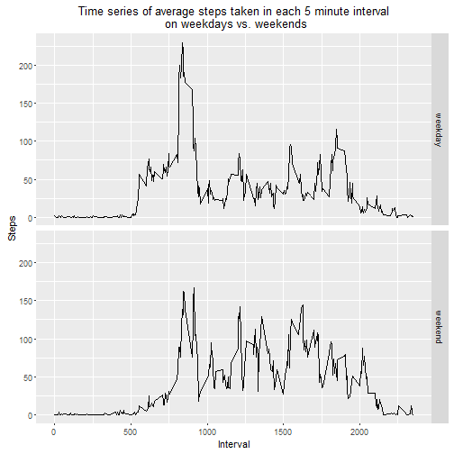

## Loading and preprocessing the data

.csv file read using `read.csv` and date values converted to class "Date" using `lubridate`

```r
library(lubridate)
```

```r
unzip("activity.zip", "activity.csv")
activity <- read.csv("activity.csv", stringsAsFactors=FALSE)
activity$date <- ymd(activity$date)
```

## What is mean total number of steps taken per day?

***NOTE***: *for the following steps `NA` values are ignored*

**Calculate the total number of steps taken per day**

Total number of steps calculated using `aggregate`

```r
activityclean <- subset(activity, activity$steps != "NA")
steps <- aggregate(activityclean$steps, by=list(activityclean$date), FUN=sum)
colnames(steps) <- c("date", "steps")
head(steps)
```

```
##         date steps
## 1 2012-10-02   126
## 2 2012-10-03 11352
## 3 2012-10-04 12116
## 4 2012-10-05 13294
## 5 2012-10-06 15420
## 6 2012-10-07 11015
```

**Make a histogram of the total number of steps taken each day**

Plot generated using `ggplot2`

```r
library(ggplot2)
```

```r
ggplot(steps, aes(x=steps)) + geom_histogram(binwidth=1000) + labs(title="Histogram of number of steps taken each day", x="Number of steps", y="Frequency (Number of days)") + scale_y_continuous(breaks=seq(0,10,1))
```


**Calculate and report the mean and median of the total number of steps taken each day**

```r
mean(steps$steps)
```

```
## [1] 10766.19
```

```r
median(steps$steps)
```

```
## [1] 10765
```
The mean number of steps taken per day is **10766** and the median is **10765**.

## What is the average daily activity pattern?

**Make a time series plot of the 5-minute interval (x-axis) and the average number of steps taken, averaged across all days (y-axis)**

Total number of steps taken for each 5-minute interval averaged using `aggregate`

```r
interval.mean <- aggregate(activityclean$steps, by=list(activityclean$interval), FUN=mean)
colnames(interval.mean) <- c("interval", "steps")
head(interval.mean)
```

```
##   interval     steps
## 1        0 1.7169811
## 2        5 0.3396226
## 3       10 0.1320755
## 4       15 0.1509434
## 5       20 0.0754717
## 6       25 2.0943396
```

Plot generated using `ggplot2`      

```r
ggplot(interval.mean, aes(x=interval, y=steps)) + geom_line() + labs(title="Time series of average steps taken in each 5 minute interval", x="Interval", y="Steps")
```


**Which 5-minute interval, on average across all the days in the dataset, contains the maximum number of steps?** 

Interval containing maximum number of steps found using `which.max`

```r
interval.mean[which.max(interval.mean$steps),]
```

```
##     interval    steps
## 104      835 206.1698
```
The 5-minute interval `835` contains the maximum number of steps at 206 steps.         
## Imputing missing values

***NOTE***: *There are a number of days/intervals where there are missing values (coded as `NA`). The presence of missing days may introduce bias into some calculations or summaries of the data. Therefore following steps no longer ignore `NA` values.*

**Calculate and report the total number of missing values in the dataset (i.e. the total number of rows with `NA`s).**

Total number of missing values calculated using `sum`

```r
sum(is.na(activity$steps))
```

```
## [1] 2304
```
There are **2304** missing values.

**Devise a strategy for filling in the missing values in the dataset to create a new dataset that is equal to the original dataset but with the missing dataset filled in.**

Mean for each 5-minute interval across all days used to fill in the missing values 

```r
activityfull <- activity
na <- is.na(activityfull$steps)
meaninterval <- tapply(activityfull$steps, activityfull$interval, mean, na.rm = TRUE)
activityfull$steps[na] <- meaninterval[as.character(activityfull$interval[na])] 
```
                
Check there are no `NA` values left

```r
sum(is.na(activity$steps)) 
```

```
## [1] 2304
```

**Make a histogram of the total number of steps taken each day including imputed values**

Total number of steps taken calculated using `aggregate` and plot generated using `ggplot2`

```r
stepsfull <- aggregate(activityfull$steps, by=list(activityfull$date), FUN=sum)
colnames(stepsfull) <- c("date", "steps")
                
ggplot(stepsfull, aes(x=steps)) + geom_histogram(binwidth=1000) + labs(title="Histogram of total number of steps taken each day", x="Number of steps", y="Frequency (Number of days)")
```


**Calculate and report the mean and median total number of steps per day**

```r
mean(stepsfull$steps, na.rm = TRUE)
```

```
## [1] 10766.19
```

```r
median(stepsfull$steps, na.rm = TRUE)
```

```
## [1] 10766.19
```
When the missing values are filled in, both the mean and the median number of steps taken per day is **10766**. The mean is the same value as when the missing values were ignored, however, the median has increased by 1 step. It seems the impact of imputing missing data has little to no effect on the estimates of the total daily number of steps.               

## Are there differences in activity patterns between weekdays and weekends?
**Create a new factor variable in the dataset with two levels - "weekday" and "weekend" indicating whether a given date is a weekday or a weekend**

Factor variable created using `weekdays`

```r
weekdays1 <- c("Monday", "Tuesday", "Wednesday", "Thursday", "Friday")
activityfull$day <- factor((weekdays(activityfull$date) %in% weekdays1), levels=c(TRUE, FALSE), labels=c("weekday", "weekend"))
head(activityfull)
```

```
##       steps       date interval     day
## 1 1.7169811 2012-10-01        0 weekday
## 2 0.3396226 2012-10-01        5 weekday
## 3 0.1320755 2012-10-01       10 weekday
## 4 0.1509434 2012-10-01       15 weekday
## 5 0.0754717 2012-10-01       20 weekday
## 6 2.0943396 2012-10-01       25 weekday
```

**Make a panel plot containing a time series plot of the 5-minute interval (x-axis) and the average number of steps taken, averaged across all weekday days and weekend days (y-axis)**

Total number of steps taken for each 5-minute interval averaged for both weekday days and weekend days using `aggregate` and plot generate using `ggplot2`

```r
interval.mean.full <- aggregate(activityfull$steps, by=list(activityfull$interval, activityfull$day), FUN=mean)
colnames(interval.mean.full) <- c("interval", "day", "steps")
head(interval.mean.full)
```

```
##   interval     day      steps
## 1        0 weekday 2.25115304
## 2        5 weekday 0.44528302
## 3       10 weekday 0.17316562
## 4       15 weekday 0.19790356
## 5       20 weekday 0.09895178
## 6       25 weekday 1.59035639
```

```r
ggplot(interval.mean.full, aes(x=interval, y=steps)) + geom_line() + facet_grid(day~.) + labs(title="Time series of average steps taken in each 5 minute interval\n on weekdays vs. weekends", x="Interval", y="Steps")
```


